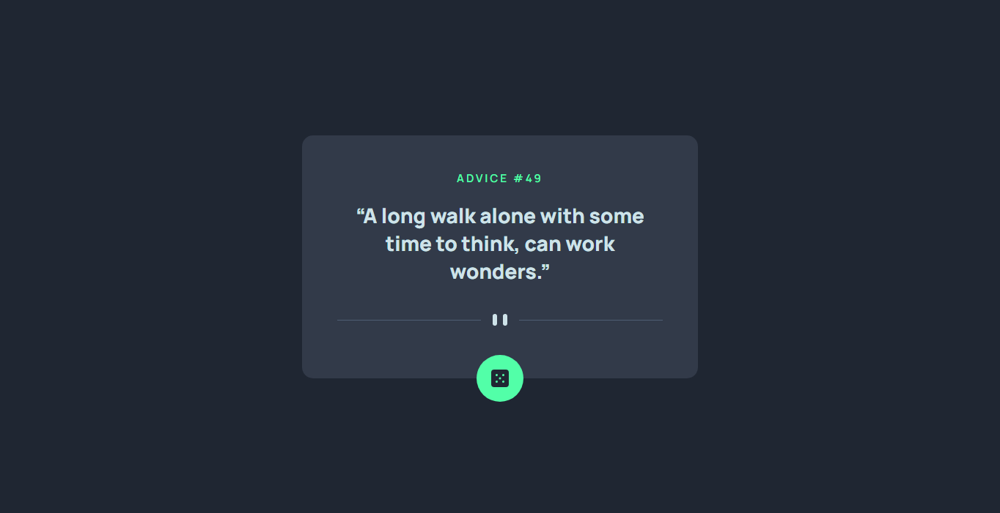

# Frontend Mentor - Advice generator app solution

This is a solution to the [Advice generator app challenge on Frontend Mentor](https://www.frontendmentor.io/challenges/advice-generator-app-QdUG-13db). Frontend Mentor challenges help you improve your coding skills by building realistic projects.

## Table of contents

- [Overview](#overview)
  - [The challenge](#the-challenge)
  - [Screenshot](#screenshot)
  - [Links](#links)
  - [Built with](#built-with)
- [Author](#author)

## Overview

An Website for showing random advices.

### The challenge

Users should be able to:

- View the optimal layout for the app depending on their device's screen size
- See hover states for all interactive elements on the page
- Generate a new piece of advice by clicking the dice icon

### Screenshot

### Links

- Solution URL: [https://www.frontendmentor.io/solutions/advice-generator-app-XpiURMMmhH](https://www.frontendmentor.io/solutions/advice-generator-app-XpiURMMmhH)
- Live Site URL: [https://lshiroc.github.io/frontend-mentor/Advice-Generator-App-Main/](https://lshiroc.github.io/frontend-mentor/Advice-Generator-App-Main/)

### Built with

- Semantic HTML5 markup
- CSS custom properties
- Flexbox
- CSS Grid
- Mobile-first workflow
- JavaScript

## Author

- GitHub - [Zeynal Mardanli - Lshiroc](https://github.com/Lshiroc)
- Frontend Mentor - [@lshiroc](https://www.frontendmentor.io/profile/lshiroc)
