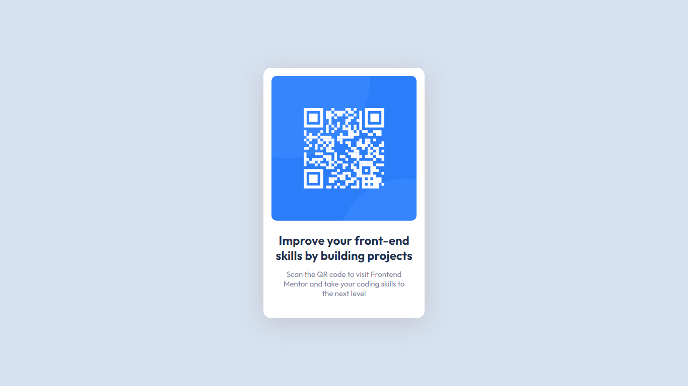

This is a challange from Frontendmentor.io

Coded by Zeynal Mardanli(Lshiroc)           
Desing, photos and icons are provided by Frontendmentor.io

### Screenshot

### Links

- Solution URL: [https://www.frontendmentor.io/challenges/qr-code-component-iux_sIO_H/hub/qr-code-component-main-with-bem-mXfclcD5s](https://www.frontendmentor.io/challenges/qr-code-component-iux_sIO_H/hub/qr-code-component-main-with-bem-mXfclcD5s)
- Live Site URL: [https://lshiroc.github.io/frontend-mentor/Qr-Code-Component-Main/](https://lshiroc.github.io/frontend-mentor/Qr-Code-Component-Main/)

### Built with

- Semantic HTML5 markup
- Flexbox
- Mobile-first workflow
- Sass
- BEM

## Author

- Frontend Mentor - [@lshiroc](https://www.frontendmentor.io/profile/lshiroc)
