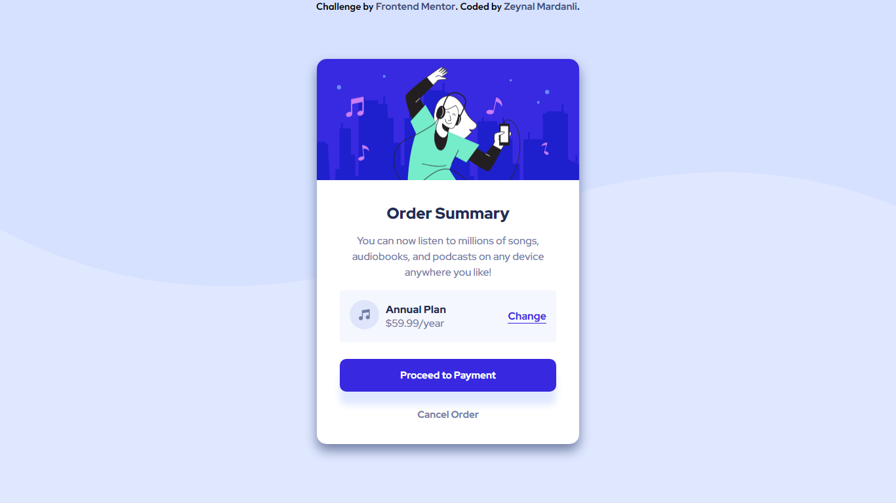

# Frontend Mentor - Order summary card solution

This is a solution to the [Order summary card challenge on Frontend Mentor](https://www.frontendmentor.io/challenges/order-summary-component-QlPmajDUj). Frontend Mentor challenges help you improve your coding skills by building realistic projects. 

### The challenge

Users should be able to:

- See hover states for interactive elements

### Screenshot

### Links

- Solution URL: [https://www.frontendmentor.io/solutions/order-summary-component-with-css-flexbox-_vztdS-1x](https://www.frontendmentor.io/solutions/order-summary-component-with-css-flexbox-_vztdS-1x)
- Live Site URL: [https://lshiroc.github.io/frontend-mentor/order-summary-component-main/](https://lshiroc.github.io/frontend-mentor/order-summary-component-main/)

### Built with

- HTML
- Flexbox
- CSS Grid

## Author
- Zeynal 'Lshiroc' Mardanli
- Frontend Mentor - [@lshiroc](https://www.frontendmentor.io/profile/lshiroc)
